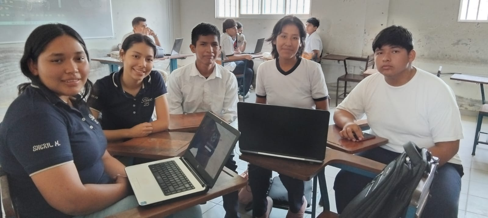

## 🛠️ Tecnologías Utilizadas

- **Frontend**: HTML5, CSS3, JavaScript ES6+
- **Almacenamiento**: LocalStorage (navegador)
- **Librerías**: SweetAlert2, Font Awesome, Google Fonts
- **Diseño**: CSS Grid, Flexbox, Animaciones CSS
- **Sin Backend**: No requiere servidor PHP, Node.js ni base de datos# 🚐 Sistema de Gestión Mototransporte Satélite

Sistema web profesional para la gestión de transporte escolar local sin base de datos, utilizando **localStorage** del navegador. **100% HTML + CSS + JavaScript** - No requiere servidor PHP.

## 📋 Descripción
Sistema completo de gestión para Mototransporte Satélite - Transporte Escolar Local, que permite administrar estudiantes, rutas, conductores y vehículos de manera eficiente y organizada.

## 🎯 Requerimientos Funcionales

### RF001 - Gestión de Estudiantes
- Registrar nuevos estudiantes con información completa
- Editar datos de estudiantes existentes
- Eliminar registros de estudiantes
- Visualizar lista completa de estudiantes
- Buscar estudiantes por diferentes criterios
### RF002 - Gestión de Rutas
- Crear rutas de transporte escolar
- Definir horarios de recogida y entrega
- Asignar zonas y paradas
- Modificar rutas existentes
- Eliminar rutas
### RF003 - Gestión de Conductores
- Registrar conductores con licencia y documentación
- Actualizar información de conductores
- Consultar historial y disponibilidad
- Gestionar asignaciones a rutas
### RF004 - Gestión de Vehículos
- Registrar vehículos con placas y capacidad
- Llevar control de mantenimiento
- Asignar vehículos a rutas
- Controlar estado y disponibilidad
### RF005 - Validaciones
- Validación de campos obligatorios
- Validación de formatos (email, teléfono, CI)
- Validación de rangos de edad
- Prevención de duplicados
- Validación de capacidad de vehículos
### RF006 - Reportes
- Generar reportes de estudiantes por ruta
- Reporte de ocupación de vehículos
- Listados de conductores y asignaciones

## 🔧 Requerimientos No Funcionales
### RNF001 - Usabilidad
- Interfaz intuitiva y fácil de usar
- Diseño responsivo para móviles, tablets y desktop
- Mensajes claros y orientativos
- Navegación fluida entre secciones
### RNF002 - Performance
- Tiempo de carga menor a 2 segundos
- Respuestas inmediatas en operaciones CRUD
- Optimización de imágenes y recursos
- Código JavaScript optimizado
### RNF003 - Seguridad
- Validación de entrada en cliente y servidor
- Prevención de inyección de código
- Sanitización de datos
- Manejo seguro de archivos
### RNF004 - Mantenibilidad
- Código modular y organizado
- Separación de responsabilidades
- Comentarios en código complejo
- Nombres descriptivos de variables y funciones
### RNF005 - Compatibilidad
- Compatible con navegadores modernos (Chrome, Firefox, Safari, Edge)
- Diseño adaptable a diferentes resoluciones
- Soporte para dispositivos táctiles
### RNF006 - Disponibilidad
- Sistema disponible 24/7
- Almacenamiento persistente en archivos
- Backup automático de datos (recomendado)
### RNF007 - Escalabilidad
- Estructura preparada para crecimiento
- Código reutilizable
- Posibilidad de migrar a base de datos
## 📁 Estructura del Proyecto

```
Mototransporte-Satelite/
├── index.html
├── README.md
├── img/
│   └── grupo.jpeg       
├── css/
│   ├── styles.css
│   ├── components.css   
│   ├── responsive.css
│   └── animations.css
└── js/
    ├── main.js          
    ├── utils.js
    ├── validation.js
    ├── students.js
    ├── routes.js
    ├── drivers.js
    └── vehicles.js
```
## 🚀 Instalación

### ✅ **VERSIÓN SIN SERVIDOR - Funciona directamente con HTML**

**Requisitos:**
- ✅ Navegador web moderno (Chrome, Firefox, Safari, Edge)
- ✅ Nada más - NO necesitas servidor

**Opciones de uso:**

### **Opción 1: Abrir directamente el archivo (Más simple)**
1. Descarga todos los archivos
2. Mantén la estructura de carpetas
3. Haz doble clic en `index.html`
4. ¡Listo! El sistema funciona

### **Opción 2: Con Live Server en VS Code (Recomendado)**
1. Abre la carpeta en Visual Studio Code
2. Instala la extensión "Live Server"
3. Click derecho en `index.html` → "Open with Live Server"
4. Se abrirá en `http://127.0.0.1:5500`

### **Opción 3: Servidor local simple**
```bash
# Con Python 3
python -m http.server 8000

# Con Node.js (http-server)
npx http-server -p 8000

# Abrir en navegador
http://localhost:8000

### **Opción 4: GitHub Pages (Hosting gratuito)**
1. Sube el proyecto a GitHub
2. Ve a Settings → Pages
3. Selecciona la rama main
4. Tu sitio estará en: `https://tu-usuario.github.io/mototransporte-satelite`

## 💾 Almacenamiento de Datos

### **LocalStorage del Navegador:**
- ✅ Los datos se guardan automáticamente en tu navegador
- ✅ Persisten al cerrar y abrir el navegador
- ✅ Capacidad: ~5-10MB (suficiente para cientos de registros)
- ⚠️ Datos locales por navegador/computadora
- ⚠️ Se pierden al limpiar caché/datos del navegador

### **Backup y Restauración:**
El sistema incluye funciones para exportar/importar datos:
- **Exportar:** Descarga archivo JSON con todos tus datos
- **Importar:** Restaura datos desde archivo JSON
- **Recomendación:** Haz backups periódicos

## 📱 Compatibilidad

- ✅ **Chrome/Edge:** Soporte completo
- ✅ **Firefox:** Soporte completo
- ✅ **Safari:** Soporte completo
- ✅ **Opera:** Soporte completo
- ✅ **Mobile:** Funciona en navegadores móviles

## 💻 Uso del Sistema

### Panel Principal
- Dashboard con estadísticas generales
- Acceso rápido a todas las secciones
- Indicadores de ocupación y disponibilidad

### Gestión de Estudiantes
1. Click en "Estudiantes"
2. Usar el botón "Nuevo Estudiante"
3. Completar el formulario con validación
4. Guardar y confirmar

### Gestión de Rutas
1. Acceder a "Rutas"
2. Crear nueva ruta con horarios
3. Asignar conductor y vehículo
4. Definir paradas y zonas

## 🎨 Características Destacadas

- ✅ **SweetAlert2** para notificaciones elegantes
- 📱 **100% Responsivo** - Funciona en todos los dispositivos
- 🎯 **Validación Completa** - Cliente y servidor
- 🎨 **Diseño Moderno** - Interfaz profesional
- ⚡ **Sin Base de Datos** - Almacenamiento en JSON
- 🔒 **Seguro** - Validación y sanitización
- 📊 **Dashboard Interactivo** - Estadísticas en tiempo real
- 🎭 **Animaciones Suaves** - Experiencia fluida

## 🛠️ Tecnologías Utilizadas

- **Frontend:**
  - HTML5
  - CSS3 (Flexbox, Grid, Animaciones)
  - JavaScript ES6+
  - SweetAlert2

- **Backend:**
  - PHP 7.4+
  - JSON para almacenamiento

## 📱 Responsividad

- **Desktop:** > 1200px
- **Tablet:** 768px - 1199px
- **Mobile:** < 767px

## 🔐 Seguridad

- Validación en cliente (JavaScript)
- Validación en servidor (PHP)
- Sanitización de entradas
- Prevención de XSS
- Manejo seguro de archivos

## 🐛 Solución de Problemas

### Error: "No se puede escribir en el archivo"
- Verificar permisos de la carpeta `data/`
- Ejecutar: `chmod 755 data/`

### Error: "SweetAlert no se carga"
- Verificar conexión a internet (CDN)
- O descargar librería localmente

### Los datos no se guardan
- Verificar que PHP esté funcionando
- Revisar logs del servidor
- Verificar permisos de escritura

## 📈 Futuras Mejoras

- [ ] Sistema de notificaciones por email/SMS
- [ ] Integración con GPS para tracking
- [ ] App móvil nativa
- [ ] Sistema de pagos en línea
- [ ] Panel de padre de familia
- [ ] Reportes en PDF
- [ ] Migración a base de datos MySQL
## 📄 Licencia

© 2025 Mototransporte Satélite. Todos los derechos reservados.

## 📞 Contacto

Para soporte o consultas:
- Email: soporte@mototransportesatelite.com
- Teléfono: [Tu teléfono]
- Ubicación: Warnes, Santa Cruz, Bolivia

## 🙏 Agradecimientos

- SweetAlert2 por las hermosas alertas
- La comunidad de código abierto
- A todos los usuarios del sistema

### Foto del Grupo


---

**Desarrollado con ❤️ para Mototransporte Satélite - Transporte Escolar Local**
